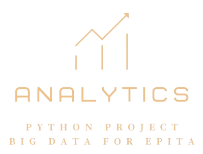

# BIG DATA PROJECT



Repository of PYBD (Python for Big Data), an EPITA course.

## Table of Contents

- [Installation](#installation)
- [Methodology](#methodology)
- [Dashboard](#dashboard)

## Installation

Clone the project repository, then follow the instructions below:

```sh
# Go to the project root
cd bigdata

# Make a directory with the path: docker/data/
mkdir docker/data

# Put the boursorama data inside "docker/data/"
unzip boursorama.zip docker/data/
 
# Launch our app and write the data inside SQL database
./launch_project

# Wait a bit
# If it does not work, use the same command again
./launch_project
```

## Methodology

### Data Reading


Firstly, regarding file reading, we opted to process the data in descending order based on the date. Indeed, some companies have changed their names multiple times since their creation while retaining the same symbol. Therefore, we always keep the latest recorded name as the company's name. Since data reading is a tedious and time-consuming task, we decided to parallelize functions to the maximum extent possible to facilitate insertions into the tables.

### Data Handling


Many modifications had to be made to the raw data for their insertion into the database, such as :

- The suffixes like `'(s)'` and `'(c)'` have been removed from the stock values to simplify adding them to the database, which imposes restrictions on column types. Now, values must be expressed in numeric form rather than as strings.

- To avoid exceeding the limit of numeric types, we capped values that exceed the maximum limit at the maximum threshold.

- We were instructed not to delete existing tables or data, but only to add to them. That's why we decided to add the `std` and `mean` columns to the `daystocks` table, which will make it easier for us to visualize the data on the dashboard later. Additionally, with the provided data, some companies are not listed in the default financial markets provided in the `markets` table. Since the IDs of the financial markets initially present start from index 1, we decided to associate the `market` for the unlisted companies with those markets already present.

## Dashboard


Above, an image of our project dashboard.

### Features

This dashboard includes numerous features:

- The selection of one or more actions (up to 6 maximum) can be displayed simultaneously on the dashboard.

-  The graphical representation of stock data can be linear, area,
- The representation of volumes associated with stocks can be displayed only when a single stock is selected.
- Buttons below the graph allow switching to logarithmic scale or displaying Bollinger Bands.

- The summary of the latest day recorded (the highest value, the lowest value, the opening value, the closing value, and the volume of shares traded).

- A table representing the historical values of a stock by day.
-